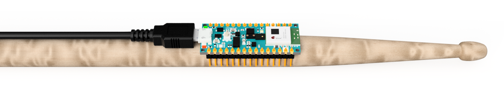
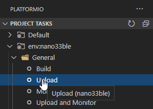

# OpenDrum

OpenDrum is the open-source version of Drumless - an award-winning air-drumming system. It is built around an Arduino Nano 33 BLE (Sense).

## Getting Started

1. PlatformIO needs to be installed first (see [instructions](https://platformio.org/install)).
2. Then, clone this repository and open it using VS Code.
3. Connect your Arduino Nano 33 BLE (Sense) via USB.
4. Click on the PlatformIO icon .
5. Click on Build and then Upload:

   

6. Connect to `OpenDrum` on your mobile phone (e.g. via GarageBand on and iPhone).
