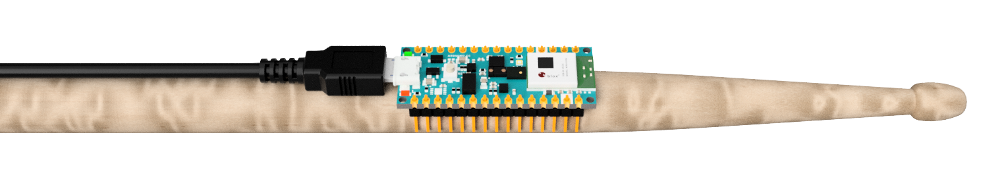

# OpenDrum

OpenDrum is the open-source version of Drumless - an award-winning air-drumming system. It is built around an Arduino Nano 33 BLE (Sense).



## Getting Started

1. PlatformIO needs to be installed first (see [instructions](https://platformio.org/install)).
2. Then, clone this repository and open it using VS Code.
3. Connect your Arduino Nano 33 BLE (Sense) via USB.
4. Click on the PlatformIO icon .
5. Click on Build and then Upload:

   

6. (Optional, but highly recommended) run the calibration steps described in the `Gyroscope Bias Estimation` section.
7. Connect to `OpenDrum` on your mobile phone (e.g. via GarageBand on and iPhone) and have fun.

## Gyroscope Bias Estimation

To get good results from the sensor fusion algorithm, it is crucial to correct any bias in the gyroscope readings. To do this, follow the instructions below. The process below needs to be done only once, but it's rather clumsy; if anyone is willing to contribute and make it easier, I'm happy to give guidance.

1. Open `src/main.cc` and uncomment the following line:

```c++
// marg.estimate_gyro_bias();
```

2. Place your Arduino on a stable surface (it should be completely stationary during calibration).
3. Upload the modified code, and open the Serial Monitor in the Arduino IDE. You may want to disable `Autoscroll`. You should see the text below. Copy the second line and replace the similar looking line in `src/main.cc`.

```
Estimating gyroscope bias...
float g_bias[3] = {0.064288, 0.069856, -0.032735};
Estimating gyroscope bias done!
```

4. Comment the line below in `src/main.cc` and Upload the firmware again. You are done!

```c++
marg.estimate_gyro_bias();
```
